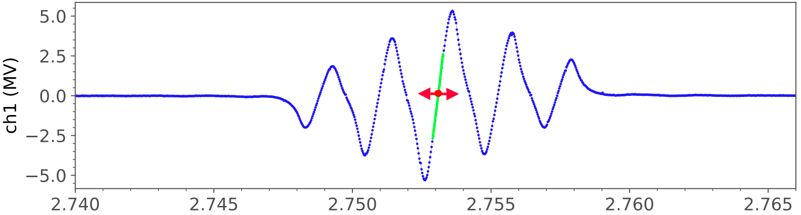

# ODMR Frequency Lock Implementation

**Date:** 2025-01-30  
**Status:** ✅ Complete - Ready for FPGA compilation and testing  
**Planning Reference:** `odmr_tracking_planning.md`

---

## Table of Contents

1. [Problem Statement & Physical Context](#problem-statement--physical-context)
2. [Control Theory](#control-theory)
3. [Implementation Architecture](#implementation-architecture)
4. [Register Map](#register-map)
5. [Tuning & Commissioning](#tuning--commissioning)
6. [Noise Analysis](#noise-analysis)
7. [Troubleshooting](#troubleshooting)
8. [Future Enhancements](#future-enhancements)

---

## Problem Statement & Physical Context

### The Physical System

This implementation addresses **tracking a time-varying resonance frequency** in a physical system (e.g., optically-detected magnetic resonance in nitrogen-vacancy centers in diamond).

**Signal Generation:**
- The FPGA generates a **frequency-modulated RF signal** via DDS at approximately 20 MHz:
  ```
  f(t) = f₀(t) + f_dev × sin(2π × f_m × t)
  ```
  where `f₀(t)` is the center frequency to be locked to resonance, `f_dev` is the frequency deviation, and `f_m ≈ 15.25 kHz` is the modulation frequency.

**Physical Response:**
- The signal excites a **Lorentzian resonance** at frequency `f_r(t)` which drifts over time due to environmental factors.
- Lock-in demodulation extracts a **dispersion-like signal** that is linear in detuning around resonance:
  ```
  e[n] ≈ K × (f₀[n] - f_r[n])
  ```
  where `K ≈ 1.1 LSB/Hz` is the measured slope.

  

**Control Objective:**
> **Lock the FPGA-generated frequency f₀(t) to the resonance frequency f_r(t) by keeping the demodulated signal e[n] at its zero-crossing.**

### Signal Processing Chain

```
FPGA DDS (3FGEN)                Physical System
┌─────────────────┐            ┌──────────────┐
│ f₀(t) + FM      │────DAC────>│  Lorentzian  │
│ Phase Acc + FTW │            │  Resonance   │
└─────────────────┘            └──────┬───────┘
        ▲                             │
        │ ftw_correction              │ response
        │                             ▼
┌───────┴─────────┐            ┌──────────────┐
│  ODMR Freq Lock │<───────────│  ADC (14-bit)│
│  (This Module)  │  demod I   └──────────────┘
└─────────────────┘                   │
        ▲                             ▼
        │ err_i                 ┌──────────────┐
        │ valid @ 30.5 kS/s     │   Lock-in    │
        │                       │  Demod (1f-I)│
        └───────────────────────│  CIC + FIR   │
                                └──────────────┘
                                  ↓ decimation
                         R=4096, ~30.5 kS/s
```

**Key timing parameters:**

| Parameter | Value |
|-----------|-------|
| FPGA clock | 125 MHz (8 ns period) |
| CIC decimation | R=4096 → 30,517.578 S/s (Ts ≈ 32.768 μs) |
| Modulation frequency | f_m ≈ 15.25 kHz |
| FIR filter | ~1 ms impulse response |
| Resonance dynamics | < few hundred Hz drift rates |

---

## Control Theory

This section presents the complete mathematical framework for the frequency-locked loop. The control law, gain formulas, and design calculations are presented and apply to both integral-only and PI modes.

### Loop Model

Around resonance, the demodulated output is proportional to frequency detuning:

$$
e[n] \approx K \cdot (f_0[n] - f_r[n])
$$

**Parameters:**
- `e[n]`: Demodulated error (32-bit signed LSB from FIR output)
- `K`: Discriminator slope (measured; typical value 1.1 LSB/Hz)
- `f₀[n]`: FPGA-generated center frequency
- `f_r[n]`: Physical resonance frequency (time-varying)

**Plant transfer function** (`f₀ → e`):
- DC gain: `K` (positive slope)
- Delay: CIC + FIR group delay (~0.5-1 ms)
- Sample rate: Ts = 32.768 μs

### Control Law

The module supports two modes, selected by the `prop_enable` control bit:

**Integral-only mode** (`prop_enable=False`, default):
$$
f_0[n+1] = f_0[n] - \mu \cdot e[n]
$$

**PI mode** (`prop_enable=True`, faster acquisition):
$$
u[n] = K_p \cdot e[n] + x[n] \quad \text{(output)}
$$
$$
x[n+1] = x[n] - \mu \cdot e[n] \quad \text{(integrator state)}
$$

where:
- `μ`: Integral gain (Hz/LSB)
- `K_p`: Proportional gain (Hz/LSB)
- `u[n]`: Total correction applied to DDS
- `x[n]`: Integral state

### Why This Design?

1. **Integral action** ensures zero steady-state error (`e → 0` at equilibrium)
2. **Proportional action** (optional) speeds acquisition and improves phase margin
3. Single-parameter tuning in I-only mode; two-parameter in PI mode

### Gain Formulas

For a target closed-loop bandwidth `B`:

**Integral gain:**
$$
\boxed{\mu = \frac{2\pi \cdot B \cdot T_s}{K}} \quad [\text{Hz/LSB}]
$$

**Proportional gain** (for PI mode, placing zero at `B/α` where α ∈ [2, 4]):
$$
\boxed{K_p = \frac{\alpha}{K}} \quad [\text{Hz/LSB}]
$$

The PI zero cancels phase lag from the integral term. Default α=3 should provide good damping.

### DDS Implementation

The FPGA DDS uses frequency tuning words (FTW):
$$
\text{FTW} = \frac{f}{f_{clk}} \cdot 2^{32}
$$

**Conversion constant** (Red Pitaya @ 125 MHz):
$$
\text{FTW\_PER\_HZ} = \frac{2^{32}}{125 \text{ MHz}} \approx 34.359738
$$

The control law in FTW units:
$$
\mu_{FTW} = \mu \times \text{FTW\_PER\_HZ} \quad [\text{FTW/LSB}]
$$
$$
K_{p,FTW} = K_p \times \text{FTW\_PER\_HZ} \quad [\text{FTW/LSB}]
$$

### Fixed-Point Representation (Q8.24)

Gains are stored in **Q8.24 format** (8 integer bits, 24 fractional bits):
- Range: [-128, +128)
- Resolution: 2⁻²⁴ ≈ 5.96×10⁻⁸

To convert a floating-point gain to Q8.24:
$$
\text{register\_value} = \text{round}(\text{gain}_{FTW} \times 2^{24})
$$

### Design Example (300 Hz Bandwidth)

**Given:** B = 300 Hz, K = 1.1 LSB/Hz, Ts = 32.768 μs, α = 3

| Quantity | Formula | Value | Q8.24 Hex |
|----------|---------|-------|-----------|
| μ (Hz/LSB) | 2π×300×32.768μs / 1.1 | 0.05615 | — |
| μ_FTW (FTW/LSB) | 0.05615 × 34.36 | 1.929 | `0x01EDE8D0` |
| K_p (Hz/LSB) | 3 / 1.1 | 2.727 | — |
| K_p,FTW (FTW/LSB) | 2.727 × 34.36 | 93.71 | `0x5DB55838` |

These are the **default values** programmed into the FPGA registers.

### Stability Analysis

**Open-loop transfer function:**
$$
L(s) = K \cdot e^{-s \tau_d} \cdot \frac{\mu}{T_s \cdot s}
$$

**Phase margin at crossover** (for I-only at 300 Hz with τ_d = 1 ms):
- Integral: -90°
- Delay: -108° (= 2π × 300 × 0.001 rad)
- **Total: ~-18° (marginal!)**

**Recommendations:**
- Start at **150 Hz bandwidth** (PM ≈ +36°)
- Verify stability before increasing
- Use **PI mode** for better phase margin at higher bandwidths (+27° improvement)

| Mode | Phase Margin @ 300 Hz | Settling Time |
|------|----------------------|---------------|
| Integral-only | ~18° (marginal) | ~8-10 ms |
| PI (α=3) | ~45° (comfortable) | ~4-6 ms |

---

## Implementation Architecture

### Files Created/Modified

| File | Status | Description |
|------|--------|-------------|
| `pyrpl/fpga/rtl/odmr_freq_lock_1f.v` | ✅ Created | Verilog module (394 lines) |
| `pyrpl/fpga/rtl/red_pitaya_top.v` | ✅ Modified | Instantiation @ lines 811-835 |
| `pyrpl/fpga/rtl/red_pitaya_3fgen.v` | ✅ Modified | FTW correction input |
| `pyrpl/hardware_modules/odmr_freq_lock.py` | ✅ Created | Python interface (595 lines) |
| `pyrpl/hardware_modules/__init__.py` | ✅ Modified | Added `OdmrFreqLock` import |
| `pyrpl/redpitaya.py` | ✅ Modified | Registered in `cls_modules` |

### FPGA Module (`odmr_freq_lock_1f.v`)

**Location:** `pyrpl/fpga/rtl/odmr_freq_lock_1f.v`  
**Base Address:** `0x40800000` (Region 8)

#### Functional Blocks

1. **Error Conditioning:** Selectable polarity inversion; deadband comparator
2. **Integral Path:** DSP48E multiply (64-bit product), Q8.24 scaling, saturating accumulator
3. **Proportional Path:** Parallel DSP multiply, gated by `prop_enable`
4. **PI Combiner:** Sum with saturation, anti-windup logic
5. **Lock Detector:** Counts consecutive samples below deadband threshold
6. **System Bus Interface:** 9 registers with standard Red Pitaya protocol

#### HDL Implementation Details

**Integral multiply:**
```verilog
wire signed [63:0] product = -($signed(reg_mu_q) * $signed(err_conditioned));
wire signed [63:0] product_rounded = product + (64'sd1 << 23);  // Rounding
wire signed [31:0] delta_ftw = product_rounded[24 +: 32];
```

**Proportional term (PI mode):**
```verilog
wire signed [31:0] p_term = (ctrl_prop_enable && !deadband_skip)
                            ? delta_p_ftw : 32'b0;
```

**Anti-windup:** When PI sum saturates, the integrator is held (not updated) to prevent wind-up:
```verilog
if (!pi_saturated)
    ftw_corr <= sum_extended;  // Update
else
    ftw_corr <= ftw_corr;      // Hold (anti-windup)
```

#### Resource Utilization

| Resource | I-only Mode | PI Mode |
|----------|-------------|---------|
| DSP48E slices | 1 | 2 |
| LUTs | ~150 | ~200 |
| FFs | ~180 | ~200 |
| Clock | 125 MHz (single-cycle) | 125 MHz |

### Python Hardware Module (`odmr_freq_lock.py`)

**Location:** `pyrpl/hardware_modules/odmr_freq_lock.py`

The Python module provides:
- Descriptor-based registers following PyRPL conventions
- Unit conversion properties (`mu_hz_per_lsb`, `kp_hz_per_lsb`, `correction_hz`)
- Configuration persistence via `_setup_attributes`
- Helper methods: `set_bandwidth()`, `set_bandwidth_pi()`, `clear()`, `get_status()`

See the file's docstrings for complete API documentation.

---

## Register Map

### System Bus Region 8: `0x40800000 - 0x40800020`

| Offset | Name | R/W | Type | Description |
|--------|------|-----|------|-------------|
| 0x0000 | **CTRL** | R/W | bits | **Control Register**<br>Bit[0]: `enable` - Enable loop<br>Bit[1]: `invert` - Invert error sign<br>Bit[2]: `hold` - Freeze integrator<br>Bit[3]: `clr` - Clear integrator (self-clearing)<br>Bit[4]: `deadband_en` - Enable deadband<br>Bit[5]: `prop_enable` - Enable PI mode |
| 0x0004 | **MU_Q** | R/W | Q8.24 | Integral gain μ_FTW. Default: `0x01EDE8D0` |
| 0x0008 | **DEADBAND** | R/W | U32 | Deadband threshold (LSB). Default: 100 |
| 0x000C | **FTW_LIM** | R/W | U32 | Saturation limit (FTW). Default: 34,359,738 (±1 MHz) |
| 0x0010 | **STATUS** | R | bits | Bit[0]: `locked`<br>Bit[1]: `saturated` (any)<br>Bit[2]: `saturated_i`<br>Bit[3]: `saturated_pi` |
| 0x0014 | **ERR_LATCH** | R | S32 | Last error value (LSB) |
| 0x0018 | **FTW_INT** | R | S32 | Integrator state (FTW) |
| 0x001C | **KP_Q** | R/W | Q8.24 | Proportional gain K_p,FTW. Default: `0x5DB55838` |
| 0x0020 | **FTW_OUT** | R | S32 | Actual correction output to DDS |

### Python Interface Summary

```python
from pyrpl import Pyrpl
p = Pyrpl('odmr_experiment')
odm = p.rp.odmr_freq_lock

# Configure integral-only mode
odm.set_bandwidth(300, slope_lsb_per_hz=1.1)
odm.max_correction_hz = 1e6
odm.enable = True

# Or configure PI mode (faster)
odm.set_bandwidth_pi(300, slope_lsb_per_hz=1.1, zero_ratio=3)

# Monitor
print(f"Locked: {odm.locked}, Correction: {odm.correction_hz:.1f} Hz")
```

---

## Tuning & Commissioning

### Step 1: Polarity Verification

Ensure correct loop sign (wrong polarity → positive feedback → instability).

```python
import time

odm.enable = False
p.rp.fgen3.component0.frequency += 200  # +200 Hz step
time.sleep(0.1)

error_after = odm.error_lsb
print(f"Error after +200 Hz step: {error_after} LSB")

# Correct: Positive freq step → Positive error
if error_after < 0:
    print("⚠️  Wrong polarity! Setting invert=True")
    odm.invert = True

p.rp.fgen3.component0.frequency -= 200  # Return
```

### Step 2: Conservative Bandwidth Start

Start at reduced gain for stability margin.

```python
import numpy as np

odm.set_bandwidth(150, slope_lsb_per_hz=1.1)  # Conservative
odm.max_correction_hz = 1e6
odm.enable = True

# Monitor for 5 seconds
errors = []
for i in range(50):
    errors.append(odm.error_lsb)
    print(f"t={i*0.1:.1f}s  Error: {errors[-1]:6d}  Locked: {odm.locked}")
    time.sleep(0.1)

if np.std(errors) > 100 and not odm.locked:
    print("⚠️  Oscillation detected - reduce gain")
```

### Step 3: Bandwidth Increase

Gradually approach target bandwidth.

```python
for bw in [150, 200, 250, 300]:
    print(f"\nTesting {bw} Hz")
    odm.set_bandwidth(bw, slope_lsb_per_hz=1.1)
    time.sleep(1.0)
    
    errors = [odm.error_lsb for _ in range(30)]
    if np.std(errors) > 200:
        print(f"⚠️  Unstable - backing off to {bw-50} Hz")
        odm.set_bandwidth(bw - 50, slope_lsb_per_hz=1.1)
        break
    print(f"✓ Stable at {bw} Hz")
```

### Step 4: Deadband Tuning

Prevent integrator random walk from noise.

```python
odm.deadband_enable = False
time.sleep(2.0)

errors = [odm.error_lsb for _ in range(100)]
noise_std = np.std(errors)
print(f"Error noise: σ={noise_std:.1f} LSB")

# Set deadband to 2-3σ
deadband = max(50, int(2.5 * noise_std))
odm.deadband_lsb = deadband
odm.deadband_enable = True
print(f"Deadband set to {deadband} LSB")
```

### Step 5: Slope Calibration (Optional)

Measure discriminator slope `K` for accurate bandwidth setting.

```python
def measure_slope(odm, fgen, f_nominal, step_hz=100, n_steps=5):
    odm.enable = False
    time.sleep(0.2)
    
    freqs, errors = [], []
    for df in np.linspace(-step_hz*n_steps/2, step_hz*n_steps/2, n_steps):
        fgen.component0.frequency = f_nominal + df
        time.sleep(0.1)
        freqs.append(f_nominal + df)
        errors.append(odm.error_lsb)
    
    K, _ = np.polyfit(freqs, errors, 1)
    fgen.component0.frequency = f_nominal
    print(f"Measured slope: K = {K:.3f} LSB/Hz")
    return K

K = measure_slope(odm, p.rp.fgen3, f_nominal=20e6)
odm.set_bandwidth(300, slope_lsb_per_hz=K)
```

### Step 6: Long-Term Tracking

Record resonance drift over time.

```python
import matplotlib.pyplot as plt

duration_s = 60
times, corrections = [], []

t0 = time.time()
for _ in range(duration_s * 10):
    times.append(time.time() - t0)
    corrections.append(odm.correction_hz)
    time.sleep(0.1)

plt.plot(times, corrections)
plt.ylabel('Frequency Correction (Hz)')
plt.xlabel('Time (s)')
plt.grid(True)
plt.show()
print(f"Drift range: {np.ptp(corrections):.1f} Hz")
```

---

## Noise Analysis

### Arithmetic Precision

The FPGA arithmetic preserves signal quality:

```
err_i (32-bit) × μ_Q (Q8.24) = 64-bit product
    ↓ round & shift
delta_ftw (32-bit) → accumulate in ftw_corr (32-bit)
```

Frequency resolution: 1 FTW ≈ 0.029 Hz. No significant quantization noise is added.

### Open-Loop vs Closed-Loop Noise

| Mode | Stream Source | Loop State | Noise Behavior |
|------|---------------|------------|----------------|
| Open-loop | `'demod'` | `enable=False` | Stationary (σ_f = σ_e / K) |
| Closed-loop | `'ftw_corr'` | `enable=True` | Random walk (σ_f ∝ √t) |

### Integrator Random Walk

In closed-loop mode, the integrator accumulates noise, producing a random walk:

$$
\sigma_f(t) = \frac{\mu_{FTW} \cdot \sigma_e \cdot \sqrt{f_s \cdot t}}{\text{FTW\_PER\_HZ}}
$$

**Example** (σ_e = 50 LSB, μ_FTW = 1.93, f_s = 30.5 kHz):

| Time | Random Walk σ_f |
|------|-----------------|
| 1 s | 2.8 Hz |
| 10 s | 8.9 Hz |
| 100 s | 28 Hz |
| 1 hour | 170 Hz |

### Deadband: The Solution

The **deadband** feature prevents random walk while locked:

- When `|e[n]| < deadband`: integrator is frozen
- When `|e[n]| ≥ deadband`: normal updates resume

**Trade-off:** Minimum detectable frequency change = `deadband_lsb / K`

**Recommendation:** Set deadband to 2-3× the noise RMS.

### Practical Guidance

| Scenario | Mode | Deadband |
|----------|------|----------|
| Fast dynamics (> 1 Hz) | Closed-loop | Off |
| Slow drift (< 0.1 Hz) | Closed-loop | On |
| Characterization | Open-loop | N/A |
| Long recording (> 1 min) | Closed-loop | On |

---

## Troubleshooting

### Loop Oscillates / Unstable

**Symptoms:** Error oscillates, `locked` never asserts, saturation flickers

**Causes:**
1. Gain too high for loop delay
2. Wrong polarity (`invert` setting)

**Solutions:**
```python
odm.mu_hz_per_lsb /= 2  # Halve bandwidth
# Or check polarity (see commissioning Step 1)
```

### Loop Doesn't Lock

**Symptoms:** `locked=False`, large steady-state error, `saturated=True`

**Causes:**
1. Initial detuning exceeds capture range
2. Saturation limit too tight

**Solutions:**
```python
odm.max_correction_hz = 2e6  # Increase range
# Or pre-tune closer to resonance before enabling
```

### Random Walk When Locked

**Symptoms:** Correction drifts slowly, `locked` flickers

**Cause:** Demodulation noise couples into integrator

**Solution:**
```python
odm.deadband_lsb = int(3 * noise_rms)
odm.deadband_enable = True
```

### Python Module Not Found

**Symptom:** `AttributeError: 'RedPitaya' object has no attribute 'odmr_freq_lock'`

**Solution:** Verify module is registered in `hardware_modules/__init__.py` and `redpitaya.py`. Restart kernel.

### FPGA Compilation Fails

**Debugging:**
1. Check `out/synth_design.log` for errors
2. Verify Region 8 not used elsewhere
3. Check `out/post_route_utilization.rpt` for resource exhaustion

---

## Future Enhancements

### Implemented

- ✅ **PI Control:** Proportional path for faster acquisition and better phase margin

### Planned

1. **2f Drift Compensation:** Use 2f-I signal for slow baseline correction (two-timescale control)

2. **Adaptive Gain:** Online estimation of slope `K` via dither injection; automatic μ adjustment

3. **DMA Streaming:** AXI-Stream output for high-rate correction logging without bus polling

---

## Appendix: Quick Reference

### Conversion Formulas

| From | To | Formula |
|------|----|---------|
| Hz | FTW | `FTW = Hz × 34.359738` |
| FTW | Hz | `Hz = FTW / 34.359738` |
| FTW/LSB | Q8.24 | `reg = round(value × 2²⁴)` |
| Q8.24 | FTW/LSB | `value = reg / 2²⁴` |

### Default Register Values

| Register | Hex Value | Physical Meaning |
|----------|-----------|------------------|
| MU_Q | `0x01EDE8D0` | 1.929 FTW/LSB (300 Hz BW, I-only) |
| KP_Q | `0x5DB55838` | 93.71 FTW/LSB (300 Hz BW, PI) |
| FTW_LIM | `0x020C49BA` | ±1 MHz correction range |
| DEADBAND | `0x00000064` | 100 LSB threshold |

### Status Criteria

| Criterion | Status |
|-----------|--------|
| FPGA synthesis | ✅ Complete |
| Python module | ✅ Complete |
| Hardware testing | ⏳ Pending |


**Files:**
- FPGA: `pyrpl/fpga/rtl/odmr_freq_lock_1f.v`
- Python: `pyrpl/hardware_modules/odmr_freq_lock.py`